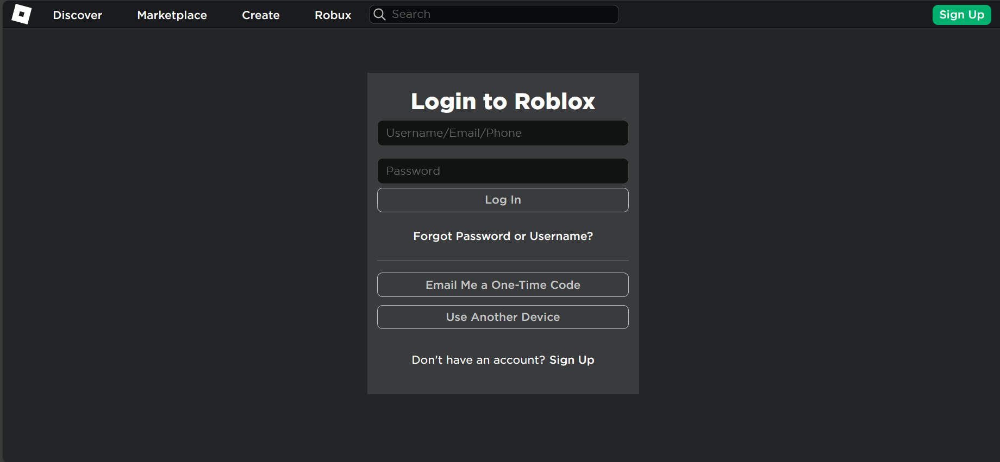
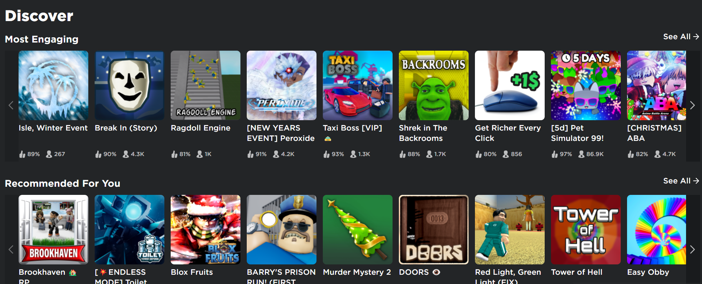
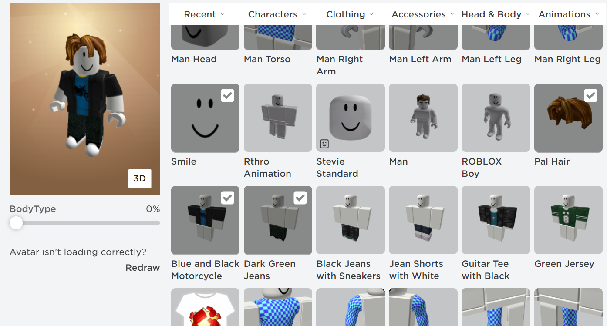

# individual_project

 Индивидуальный проект по теме:

**Roblox** — это онлайн-платформа, которая позволяет пользователям создавать свои собственные игры и играть в игры, созданные другими пользователями. Это виртуальный мир, где каждый может быть тем, кем хочет быть, и делать то, что ему нравится. 

Условия использования:
1. Быть зарегистрированным пользователем: для доступа к функциям платформы необходимо создать учетную запись на сайте Roblox.
2. Загрузить клиентское приложение.
3. Быть подключенным к интернету.

Установка программы:
1. Перейдите на официальный сайт Roblox (https://www.roblox.com).
2. Нажмите на кнопку "Получить Roblox" в верхнем правом углу экрана.
3. Выберите платформу, на которой вы хотите установить приложение (например, Windows, Mac, iOS, Android или Xbox).
4. Нажмите на кнопку "Скачать" или "Установить" в соответствии с вашей платформой.
5. Следуйте инструкциям на экране для завершения загрузки и установки приложения.

Порядок использования
1. Войдите в свою учетную запись.

2. Просмотрите каталог игр.

3. Выберите игру или создайте собственную.

4. Изменяйте ваш аватар и улучшайте свой профиль.

